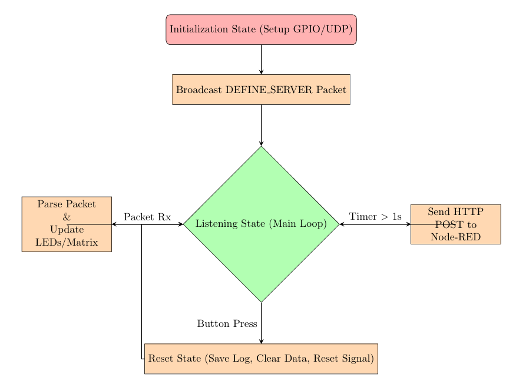

# Distributed IOT Swarm Sensor Network

An IoT swarm system built with **Raspberry Pi 5** and **3× ESP32** units that compete in real-time to become the "Master" based on ambient light intensity. The system features live web visualization via Node-RED and physical feedback through LEDs and an 8×8 LED matrix.

---

## 📡 System Architecture

```
[ ESP32 #1 ] ──┐
[ ESP32 #2 ] ──┼──── UDP (Port 2910) ──── [ Raspberry Pi 5 ] ──── HTTP POST ──── [ Node-RED Dashboard ]
[ ESP32 #3 ] ──┘                                │
                                           GPIO LEDs + 8×8 Matrix
```

### Hardware Components
| Component | Connected To | Purpose |
|---|---|---|
| 3× Photoresistor (ADC Pin 34) | ESP32 units | Sense ambient light |
| 3× LED (PWM Pin 23) | ESP32 units | Visual master indicator |
| 1× LED Bar Graph | ESP32 #1 | Local light level display |
| 5× LEDs (GPIO 17, 27, 22, 12, 23) | Raspberry Pi | Master device indicator (R/G/B/Y/W) |
| Push Button (GPIO 24) | Raspberry Pi | Trigger system reset |
| 8×8 LED Matrix MAX7219 (SPI) | Raspberry Pi | Rolling light intensity graph |

---

## 📦 Communication Protocol

### Binary Packet (ESP ↔ Swarm, every 100ms)
- **Length:** 14 bytes | **Header:** `0xF0` | **Footer:** `0x0F`

| Packet Type | Description |
|---|---|
| `LIGHT_UPDATE_PACKET` | Broadcasts ESP ID, Master State, Light Value (2 bytes) |
| `RESET_SWARM_PACKET` | Sent by RPi to force ESP reboot |
| `DEFINE_SERVER_LOGGER_PACKET` | Sent by RPi to announce its IP to the swarm |

### JSON Packet (Master ESP → RPi, every 1000ms)
```json
{ "id": <int>, "light": <int> }
```

### HTTP POST (RPi Python → Node-RED)
| Endpoint | Data |
|---|---|
| `/light_data` | Real-time photocell traces |
| `/master_duration` | Bar chart statistics |
| `/reset` | Clears dashboard on button press |

---

## 🧠 State Machine (Raspberry Pi)



---

## 🗂️ Repository Structure

```
code-red-iot/
│
├── raspberry_pi/
│   ├── Code_Red.py              # Main RPi script (UDP listener, LED control, logging)
│
├── esp32/
│   ├── Code_Red.ino             # Main Arduino sketch (shared across all 3 units)
│   └── config.h                 # Per-device config (Device ID, WiFi credentials)
│
├── node_red/
│   └── flows.json               # Node-RED flow export (import directly into Node-RED)
│
├── logs/                        # Auto-generated log files (gitignored sample included)
│   └── sample_log.txt           # Example log output
│
├── docs/
│   ├── schematic.pdf            # Circuit schematic (EasyEDA export)
│   ├── physical_photo.jpg        # Physical circuit photo
│
└── README.md
```

---

## 🚀 Setup & Installation

### Prerequisites
- Raspberry Pi 5 running Raspberry Pi OS
- Arduino IDE with ESP32 board support
- Node-RED installed on RPi (`npm install -g --unsafe-perm node-red`)

### Raspberry Pi Setup

```bash
# Install Python dependencies
pip install luma.led-matrix RPi.GPIO requests

# Run the main script
python3 raspberry_pi/main.py
```

### ESP32 Setup
1. Open `esp32/esp32_main.ino` in Arduino IDE
2. Edit `config.h` with your WiFi credentials and assign a unique Device ID (1, 2, or 3)
3. Flash to each ESP32 unit

### Node-RED Setup
1. Start Node-RED: `node-red-start`
2. Navigate to `http://<rpi-ip>:1880`
3. Import `node_red/flows.json` via the hamburger menu → **Import**
4. Deploy and open the dashboard at `http://<rpi-ip>:1880/ui`

---

## 📊 Features

- **Swarm Consensus:** Devices broadcast light readings every 100ms; the ESP with the highest reading becomes the Master
- **Physical Feedback:** RPi LEDs change color to indicate which device is currently Master
- **LED Matrix Graph:** Rolling 30-second history of light intensity displayed on 8×8 matrix
- **Live Dashboard:** Node-RED displays real-time photocell traces and master duration bar chart
- **Persistent Logging:** Button press saves a timestamped `.txt` log and resets the swarm
- **Fault Tolerance:** Python script continues running even if Node-RED server goes offline

---

## 📁 Log File Format

Each log entry is a comma-separated line: `elapsed_time, device_ip, light_value`

```
Log generated at: 2025-12-02_12-27-16
--- Logged information since last Button Press ---
0.111, 192.168.0.169, 1935
3.897, 192.168.0.220, 2117
...
```

---

## 🛠️ Built With

- [luma.led-matrix](https://github.com/rm-hull/luma.led-matrix) — MAX7219 driver
- [RPi.GPIO](https://pypi.org/project/RPi.GPIO/) — GPIO control
- [Node-RED](https://nodered.org/) — Visual web dashboard
- [Arduino ESP32](https://github.com/espressif/arduino-esp32) — ESP32 firmware

---

## 👤 Author

**Arya Sureshbhai Patel**  
